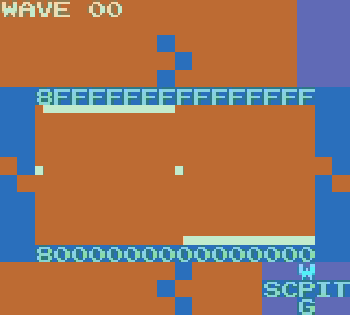
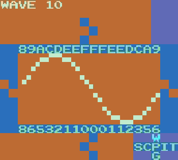
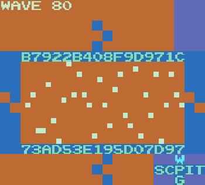
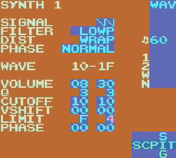

**Intense Tech with Defense Mech – LSDj Wave Synth Deep Dive Part 2**
-Posted November 8th, 2018 by [DEFENSE MECHANISM](https://defensemech.com)
*Note: [traducción al Español por Pixel Guy encontrado 
aquí](../es/02-analisis-del-sintetizador-del-canal-wave-en-lsdj-parte-dos.md.html).*

Hello and welcome back to Intense Tech! Join in as we explore the features of LSDj in depth with the 
ultimate goal of helping you, the reader, level up your understanding of the program!

In this tutorial we’ll continue covering what one needs to understand the Wave channel synth!  [Last 
time](lsdj-wave-synth-deep-dive-part-1.html) we
covered Signal, Volume, Filter, Cutoff, and Q. This time we’re specifically getting into the wave 
synth parameters of Dist, Phase, Vshift, and Limit. We’re going
to show you how to add some real noisy crunch to your wave sounds! By the end you should have a 
great idea of how to get any kind of sound out of the wave channel,
from a silky smooth lead to a gnarly crunchy bass.

-----------------------

If you like this article, please check out the corresponding [LSDj Learning Lab video series about 
the wave channel!](https://www.youtube.com/playlist?list=PLfhdj6Qak_ehuZgnwhiz9akZnTMsDeNpy)

<iframe width="560" height="315" style="width: 560px; height: 315px;" src="https://www.youtube.com/embed/videoseries?list=PLfhdj6Qak_ehuZgnwhiz9akZnTMsDeNpy" frameborder="0" allow="accelerometer; autoplay; clipboard-write; encrypted-media; gyroscope; picture-in-picture" allowfullscreen></iframe>

-------------------------------------

In <a href="lsdj-wave-synth-deep-dive-part-1.html">part 1</a>, I talked about how different filter 
settings affect what harmonics are produced in the wave channel.
As we have seen, the more cycles we have of a waveform in the wave frame, the higher the harmonic 
that will be produced. In fact, the number of cycles corresponds
to the number of the harmonic that will play.

If you’ve taken a look at the settings on your own or read the LSDj manual, you might have found 
another way to change the number of cycles: by changing the Phase.

The Phase parameter in LSDj compresses the shape of the waveform horizontally. When the Phase type 
is Normal, increasing the Phase value above 0 will compress the
entire waveform, adding samples at volume 0 at the end. In this way, it is analogous to changing <a 
href="https://en.wikipedia.org/wiki/Duty_cycle">pulse width,
aka duty cycle</a>. In fact, a common technique to get a smoothly modulated pulse lead (commonly 
associated with the C64 SID, for example) is to set the Signal to
Square, keep Phase type set to Normal, set the start Phase value to `00`, and the end Phase to `1F` 
(or 1E in version 4).

For an interesting vocal-like lead, try this with Triangle instead of Square.

If we change the Phase type to Resync, we’ve just given ourselves another way to add new overtones 
similar to changing the Cutoff of the wave. Resync, instead of
compressing the waveform once and adding 0-value samples at the end, repeats the waveform until all 
32 samples are filled.

(Note: in version 4 of LSDj, Phase `1F` is usually silent, so this waveform would have to be input 
manually.)

You can also experiment with Resync2, which like Resync repeats the waveform to fill the wave frame, 
but does not compress it. This normally has the effect of
lowering the volume, as when you only loop a part of the waveform, it typically doesn’t reach as 
high or low as it normally would. However, additional harmonics
are still created in the resulting waveforms.

Up to now, our changes to the waveforms have resulted in a fairly clean sound. Overtones have a 
smooth, clear sound. But what if we really want to add some grit?
We’re gonna have to get down and dirty to make our sine wave turn into something like this:

The last frame of the synth above is what pure noise looks like in the wave channel. The noisier the 
waveform gets, the more the overtones are combined differently
to add more grit. Here’s an example of what 16 different frames of pure noise sound like:

So how do we add this noise to our waveforms? One way is by essentially adding extra “notches”. This 
can be done manually, like adding some extra grit to a normal
sine wave.

Dist (Distortion) type also affects wave noise content. Distortion in LSDj refers to what happens 
when the waveform exceeds the available dynamic range, that is,
what happens when increasing a waveform’s Volume or Q takes it beyond the maximum volume. As you’ll 
recall, volume is represented by the values 0-F. If the peak
volume of the signal goes higher than F or lower than 0, the Dist type of the waveform dictates how 
LSDj reacts.

The default Dist type, Clip, chooses to just “clip” those values at 0 and F. It’s as if we just 
shave the top and the bottom right off. The more we increase the
volume of our sine wave, the more and more it starts to look and sound like a square wave.

Remember that a square wave adds extra odd overtones to the sine wave sound, so this is one 
possibility.

The next option, Fold (introduced in version 6), “mirrors” what those volumes would be across the 
top and bottom.

Now, instead of chopping off those components of our sine wave that peak over the top and bottom, 
that “excessive” volume is folded back onto the main waveform.
Compared to the deep square-like sound of Clip, this is much higher and more resonant with upper 
overtones. It’s also quieter than Clip because fewer samples are
at the very top and bottom of the dynamic range. However, you could increase the Volume or Q and let 
the samples fold back and forth multiple times to add more
crunch.

The last option, Wrap, will carry any loudness past the top and wrap the next sample upwards from 
the bottom, and vice versa. Compared to Clip and Fold, it’s
characterized by a harshness and buzz in the resulting sound. It tends to be louder than Fold 
because it distributes more samples evenly throughout the entire
dynamic range, although it’s usually not as loud as Clip.

When you set Dist to Wrap and increase the volume, many sample values are wrapped repeatedly since 
they exceed 0-F many times. This creates many instances where
samples jump across a large portion of the dynamic range. When you increase Volume or Q, you can 
cause the waveform to wrap in unpredictable ways, so it may be
difficult to dial in a precise sound. You’ll just have to experiment and hear how the various upper 
overtones will color the sound, but in general it
will sound harsh, rich, buzzy, and crunchy.

To recap what we’ve learned so far:

 - If your waveform looks like a sine, square, or triangle wave with 1 complete cycle contained 
     entirely within the wave frame, its sound will be clear and smooth. At low octaves it will have 
     plenty of bass.

 - The more repetitions of a wave cycle that are within the wave frame, the higher the frequencies 
     will be produced in the resulting notes. The number of repetitions corresponds to the harmonic 
     of the note in the harmonic series that will be produced.

 - The more noise that occurs within the wave frame, the less clear it will sound, and the more the 
     sound will be colored by the upper overtones, giving it a buzzier, ringier tone. At low octaves 
     it will have less emphasized bass and a harsher, rougher, crunchier sound.

 - Ways of adding higher frequencies include manually adding “notches” into the waveform, setting 
     higher Cutoff values and increasing the Q for emphasis, changing the Phase type and increasing 
     the values, and adding Dist of different types while increasing the Volume or Q.

Alright, so we’ve got a really noisy waveform! Now what? Maybe it’s TOO noisy! What if we like the 
sound of it, but we want to tame it a bit while still keeping
its character mostly intact?

I’m so glad you asked! Another new feature added in version 6 is the ability to Limit the volume 
AFTER the initial Volume, Cutoff, Q, and Phase are applied. The
value applied in Limit restricts the samples to a volume range, for example setting Limit to `F` 
allows all volumes 0 through F, but setting Limit to `5` only
allows volumes 5 through A (10 in hexadecimal), so values that would reach below 5 or above A are 
kept constrained within that range according to the current Dist
type.

This is an incredibly helpful feature, because as we have seen, it’s easy to reach the maximum 
available dynamic range in the Wave screen even if our Volume values
are set very low. Additionally, the Game Boy doesn’t help us much, because it only allows 4 hardware 
volumes in the Wave channel: 100%, 50%, 25%, and 0% (off).

When we are Clipping or Wrapping our waveforms and constantly reaching volume range all the way from 
0-F, the wave channel has the unfortunate tendency of often
being too loud at 100% volume but too quiet at 25% or 50%. Thankfully, now we can still choose to 
distort our waveform to get some richness with added overtones,
but with a much fuller control of range of volume. To help us even more, we have the ability to 
choose one volume range at the Start point and another volume range
at the End point. This will let us smoothly transition from loud to quiet or vice versa, as shown 
here with Limit starting at F and ending at 4.

To close, we have the Vshift, or Vertical Shift, feature. This parameter lets us shift the samples 
in the waveform upwards. In previous versions of LSDj, Vshift
functioned similarly to Wrap distortion such that as the waveform shifts vertically, after it 
reaches F it wraps around starting again at 0. This made it possible
to choose Clip Dist, increase volume, and still add wrapping with a change of Vshift to introduce 
some harsher sounds. Like Wrap, increasing Vshift often results
in unpredictable changes, but it can be fun to experiment with.

In version 6 of LSDj, Vshift follows the current Dist setting. With Clip, Vshift will squash the 
waveform towards the ceiling as the value increases. This, like
Fold and Resync2, has the effect of making the waveform quieter.

Set to Fold, it will again mirror across the top. With Vshift set to `FF`, the original wave will be 
inverted.

Set to Wrap, it will wrap around from the bottom.

Hopefully by now you’ve gotten a much better grip of how the Wave Synth works in LSDj! I hope this 
has helped you to fearlessly explore all kinds of options and
gives you a good idea of what kind of parameters you need to adjust when looking for a particular 
sound, but also I hope that it helps you experiment to find a new
sound that you haven’t heard before! See you next time!

