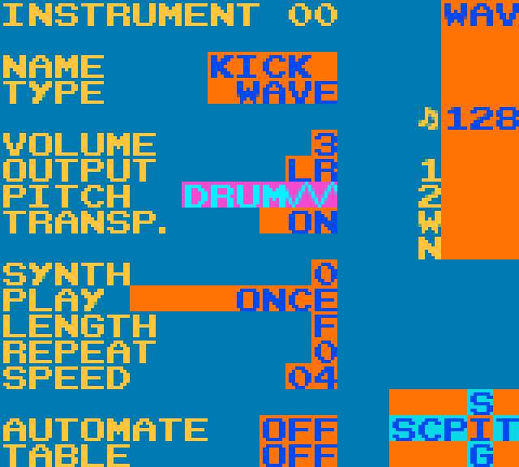

**Intense Tech with Defense Mech -- Kicks Part 2: Kick Heaven in Version 7!**
- Posted November 8th, 2019 by [DEFENSE
MECHANISM](https://defensemech.com) *Note: [traducción al Español por Pixel Guy encontrado aquí.](../es/10-kicks-parte-dos-el-paraiso-de-los-kicks-en-la-version-siete.md.html)*

Welcome back to Intense Tech with Defense Mech! This week we're
continuing with Part 2 of making kicks in LSDj including a big update!
By the end of this lesson you'll have a wide arsenal of kick techniques
to choose from. Keep reading to learn more!

------------------------------------------------------------------------

Big changes ahead!
------------------------------------------------------------------------

Last week, LSDj developer Johan Kotlinski made an update to LSDj and it
is now at version 7! (The latest version is 7.0.6 at the time of this
writing.) An exciting update in this version is that Transpose now works
with DRUM pitch, as well as "P/L/V" being renamed to "PITCH" to avoid
confusion.

Let's take a look at this feature with a kick drum that transitions into
a bass note. I'll start the kick two octaves above the note where I want
the bass to be. The table on the kick uses a fast P command followed by
an L command along with the transpose value of `E8` to slide down two
octaves.

Other uses of DRUM pitch
------------------------

As I mentioned last week, DRUM pitch is also effective for making snare
drums or toms. When making a snare drum, I usually follow the same
general table design as a kick, using a fast P command followed by an L
command to transpose to a note where I've tuned the snare drum. This
gives a sense of tonality to the snare that can then be augmented with a
noise snare for a very full-bodied sound. In this example I also lower
the volume with E commands to shape the decay.

DRUM pitch in the pulse channels
--------------------------------

DRUM pitch also works in pulse channels. Here, I've created a pulse kick
along with a snare and toms. I use the 50% duty cycle aka square wave to
get the most impact. Although the pulse channel can't reach the lower
octave that the wave channel can, it can still generate effective kicks!
The snare table is similar to the wave snare table except that I remove
the E commands and use the instrument envelope to control the decay
instead. The tom instrument has a shorter instrument length and I place
the P commands directly in the phrase to tune the pitch slide instead of
using a table.

Drums with Hardware pitch sweep in Pulse Channel 1
------------------------------------------------------

Pulse channel 1 has a hardware pitch sweep that is mostly good for
making pitchless, bleepy bloopy sounds reminiscent of old video games
(yes I realize *the entire sound chip on the Game Boy* is good for
this!), but it can also be used to make kick, snare, and tom sounds. In
this example, I used the S value of `F4` for the kick and `E3` for the
snare. Similar E values could also be used to make toms.

Noise kicks
------------------------------------------------------

Last but not least, even though it doesn't produce the most elegant
sound, the noise channel can be used to generate low pitches that serve
well as a kick. This [noise channel tutorial by Boy Meets
Robot](https://www.youtube.com/watch?v=wD7omqjHXmI) explains the noise
channel in depth, but for a quick summary, any noise shape that ends in
`0-7` will produce a more tonal sound in the noise channel, and we can
exploit this to create a smoother kick sound. Transposing down by values
of `10` will lower the octave of this buzzy tone and create a descending
pitch for a noise kick.

Combining channels
------------------------------------------------------

When we use two channels for a kick, we can combine their strengths! In
this example, I've created a very short kick using the lowest octave in
the noise channel, and I've combined it with a pulse kick. Since the
noise channel produces the low frequencies and the pulse channel
provides the downward sloping pitch and the tonal content of the kick,
the result is a fuller kick sound than using either of the channels by
itself. This example is from [my remix of Cyanide Dansen's tune 'Dox The
Fash'](https://cyanidedansen.bandcamp.com/track/dox-the-fash-remix-by-defense-mechanism)
(you can find the save file [here](https://defensemech.com/songs)):

That's all for this two part series! Come back next time *in 2020*
 to learn about even more LSDj techniques!

