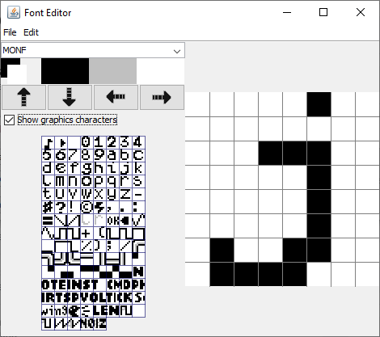

**Intense Tech with Defense Mech – Customize LSDj From Scratch with LSDPatch!**
-Posted February 21, 2021 by [DEFENSE MECHANISM](https://defensemech.com)

Hello and welcome to another edition of Intense Tech! In this edition, we're taking a look at the 
latest updates to LSDPatch, the tool that lets you customize LSDj to the fullest! Let's dive right 
in!

Getting Started with LSDPatch
------------------------------------------

First things first, LSDPatch requires Java version 8.0 or greater. Installing Java should be fairly 
straightforward if you go to [this page](https://java.com/en/download/) and follow the instructions 
for your operating system.

Next, you'll want to download the latest release from the [LSDPatch release 
page](https://github.com/jkotlinski/lsdpatch/releases) (1.10.4 at the time of writing).

Double-click on the lsdpatch .jar file and you should see a window pop up that looks similar to the 
following:

Clicking the top "Browse" button next to "Select LSDj ROM file -->" will allow you to choose the 
LSDj ROM you want to customize, and if there is a .sav file with the same file name as the ROM, it 
will be loaded also; if there is no .sav or if you want to open a different .sav, you can click the 
second "Browse" button to open the .sav file of your choice. Now we're ready to change things up!

Upgrading LSDj ROMs
-------------------

The button on the bottom left labeled "Upgrade ROM" features an easy way to upgrade to the latest 
version of LSDj.

You have the option of choosing either the latest Stable version (8.5.1 at the time of writing), the 
latest Development version (9.1.8 at the time of writing), or the latest Arduinoboy version (8.4.1 
at the time of writing). Using this method to upgrade your ROM keeps all existing customizations 
intact, so there is no need to re-patch your kits, palettes, or fonts one by one! If you would like 
to, you can also choose to view the LSDj changelog or license information.

Managing Songs
--------------

Although it was previously necessary to use an application called LSDManager to manage your songs, 
song management was combined into LSDPatch, so theoretically it is the only application you would 
need when to manage any LSDj ROMs or .sav files.

You can import .lsdsng (LSDj Song) files, and you can import and export .lsdprj (LSDj Project) 
files. The .lsdprj format includes the song data as well as the kit data from the LSDj ROM from any 
kits that were used in the song. This offers a convenient way to share song files without needing to 
include kits separately. If you want to export multiple songs, click on the first song you want to 
export, then hold Shift while clicking on the last song, and click "Export songs". Choose or create 
a new folder and select it to export the .lsdprj files to the location you've selected. Click "Add 
Songs" to load songs into the current save. It is worth noting that whichever ROM is loaded into 
LSDPatch will have its kits replaced by any .lsdprj files you choose to load, so be sure not to 
overwrite the current ROM if you want to keep the existing kits intact! 

Customizing Sample Kits
-----------------------

Speaking of kits, let's check out the new kit editor!

The first thing you may notice is the 15 MPC-style pads. Clicking on each pad will play the sample 
associated with that pad. Additionally, these are mapped to the keyboard as such:
<pre class="listing backtick" style="margin: auto; width: 100px;">
<code>1 2 3 4
Q W E R
A S D F
Z X C</code>
</pre>
Pressing these keys will play the respective samples.

Right-clicking a pad will open a menu with the options "Drop sample", "Rename sample", and "Replace 
sample". To the right, you can load/save kits, clear the current kit, rename and export the kit, add 
samples, or reload the current sample. You can also add samples by dragging and dropping them to the 
patcher window from a file explorer.

Adding new samples applies higher-quality resampling and dithering to retain as much dynamic range 
as possible when converting to 4-bit audio, and a special technique is applied to address the "wave 
RAM refresh bug."[^waveram] Each sample is also normalized to maximum volume by default. After the 
sample is added, you can adjust the volume, pitch, or length of the sample. It's now easier than 
ever to load samples into your kits without having to do additional prep work beforehand!

[^waveram]: As documented in the third bullet point 
[here](https://gbdev.gg8.se/wiki/articles/Gameboy_sound_hardware#Obscure_Behavior), the Gameboy 
plays back the first sample in a wave frame using the last completed sample in the previous wave 
frame. Sample playback requires reloading the wave RAM every frame and therefore the waveform never 
loops, so to reduce the resulting noise, every last sample of the current wave frame is blended with 
the first sample of the next wave frame when patching. Note: This code introduces noise on emulators 
that do not implement the Game Boy wave refresh bug.

At the top, you can select a kit from a drop-down menu, or use the "<" and ">" buttons to advance to 
the previous or next kit.

You may have noticed the "Half speed" option. Enabling this option allows importing and listening to 
samples at half the normal speed, which allows samples up to 4.4 seconds in length (with a reduction 
of quality at half the sample rate). The sample can then be played back at normal speed using "Speed 
0.5x" in the Kit Instrument settings in LSDj.

Fun with Fonts
--------------

Next let's take a look at the font editor!

The font editor allows for creating custom fonts in LSDj. Clicking "Show graphics characters" 
enables editing some of the extra graphical glyphs that can be seen in the Wave editor or at the top 
of the Song, Chain, Phrase, Groove, and Table screens. 

Left- or right-clicking on the black, gray, and white colors will allow each mouse button to use the 
selected color. Clicking the directional arrows will move the pixels on the current tile over one 
pixel in the direction of the arrow. You can also copy the current tile and paste to a new tile.  
Clicking on the name of the font will allow you to type in a new name to rename it. Fans of graphics 
programs can also save these fonts as .png files, edit them in external programs such as Photoshop 
or Paint, then load the custom .png files. 

You may be interested to browse the [LSDFonts page on Github](https://psgcabal.github.io/lsdfonts) 
which contains a number of user-submitted fonts. If you've created something you'd like to share, 
feel free to submit your own as well!

Palette Painting
----------------

Last, clicking on "Palettes" brings up the palette editor.

This window features screenshots of the Song and Instrument screens in LSDj, along with a color 
picker and several slots for colors. To select a color to edit, click on the color slot, or click on 
the area of the screen containing the color you would like to change and use the color picker to 
dial in the shade of your choosing. You can click "Clone color" or "Swap color" which will allow you 
to select a second color slot to either copy or exchange the color in the currently selected slot.  
You can also "Randomize all" and see what happens! 

Clicking "Raw" will change from the current color style which is meant to be a good baseline between 
different Game Boy Color hardwares to a more highly saturated color style that is commonly seen in 
some Game Boy emulators. Clicking "Desaturate" can be helpful to determine contrast between colors 
and to provide a useful gauge for different color perception. Palettes can be opened from and saved 
to .lsdpal files. 

Feel free to browse the [LSDPals repository on Github](https://github.com/psgcabal/lsdpals) for a 
selection of user-submitted palettes - your submissions are also welcome!

