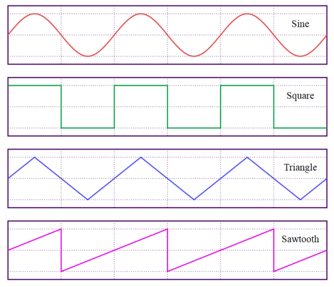
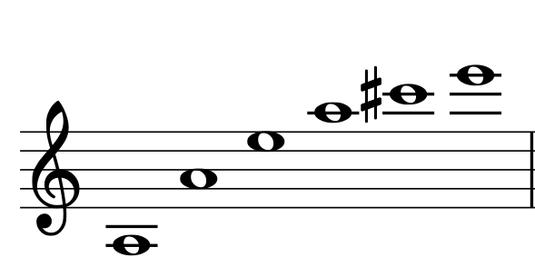
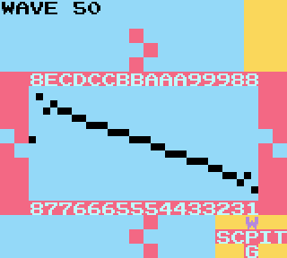
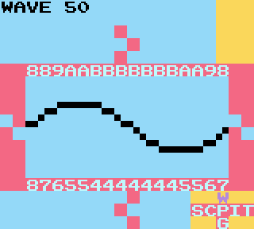
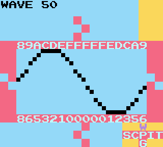
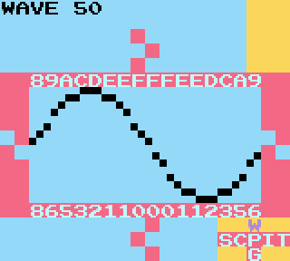
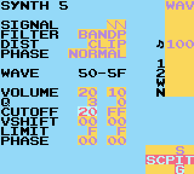
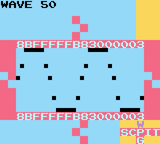
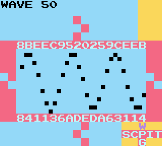
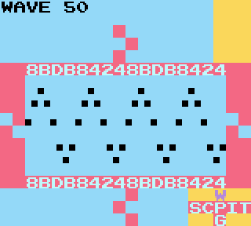

**Intense Tech con Defense Mech -- Análisis del sintetizador del canal Wave en LSDj. Parte uno**
- Posted October 12th, 2018 by [Pixel
Guy](https://apixelguy.com)
*Artículo Original de [DEFENSE
MECHANISM](../en/01-lsdj-wave-synth-deep-dive-part-1.md.html)
Traducción al Español por [Pixel Guy](https://apixelguy.com).*

¡Hola, soy DEFENSE MECHANISM! Bienvenidos a la primera entrega de
*Intense Tech*, donde daremos un vistazo detallado a algunas de las
características de LSDj. Mi objetivo es compartir conocimiento y
sabiduría que pase a las siguientes generaciones de *chiptuners*, ¡la
intención es crear un ejército de maestros en el *bleepbloopin'*!

------------------------------------------------------------------------

Una de las características más confusas, y probablemente de las más
intimidantes, del LSDj es el sintetizador del canal Wave. Tengo fe en
que después de trabajar en los siguientes ejercicios; no solo
encontrarás que es algo fácil de utilizar, sino que una vez que tengas
una idea clara de cómo funciona, entenderás por qué es uno de los
aspectos más poderosos del LSDj.

Revisaré cada parámetro a profundidad para quitarle el misterio y saber
qué es lo que está pasando; pero primero, comencemos con un vistazo
rápido al canal Wave del Gameboy en sí.

El canal Wave reproduce formas de onda de 4-bit y 32 *samples*.  Esto
puede ser representado por 32 dígitos en sistema hexadecimal  --`0-F`--,
como se puede apreciar en la pantalla WAVE del LSDj mostrada a
continuación.

Esto quiere decir que cada *sample* solo tendrá el volumen de un valor
variable entre 0 y 15 (de `0` a `F` en hexadecimal). Comparado con el audio
de 16-bit (el estándar más común para las grabaciones), que permite
65,536 valores únicos de volumen, ¡el *depth* de 4-bit de audio del
Gameboy solo permite dieciséis valores para el volumen! Mientras que
esto puede parecer mucho menos con lo cual trabajar al hacer una
comparación, está bien, ya que eso es parte de lo que le da al canal
Wave su característico sonido crujiente.

Comencemos viendo un poco de lo básico en lo que se refiere a formas de
audio, como se puede ver en [este gráfico de
Wikipedia](https://es.wikipedia.org/wiki/Sinusoide):

Al finalizar esta lección comprenderás cómo hacer una onda senoidal.
Antes de que lleguemos ahí, tenemos que explicar un poco de la teoría
que está detrás de cómo son producidas las notas musicales.

El sonido es causado por aire que vibra, y cada forma de onda mostrada
arriba es una representación de cómo lucirían esas vibraciones si
pudieras verlas. También puedes visualizarlas imaginando la forma en que
una bocina se mueve hacia adelante y hacia atrás cuando esta emite
sonidos. La onda senoidal es la forma de onda más básica ---ya que solo
contiene la frecuencia fundamental  pura de la nota base---. Las demás
contienen [armónicos](https://en.wikipedia.org/wiki/Overtone) (múltiplos
de la frecuencia original). Al combinar diferentes armónicos a
diferentes *ratios*, podemos crear formas de onda que suenen diferente
entre sí (esto es conocido como cambiar el «timbre» de un sonido).
Cuando escuchas la diferencia entre una nota tocada en un violín y la
misma nota tocada en una flauta; hay mucha diferencia en el timbre, ya
que escuchas los resultados de la mezcla de diferentes armónicos que son
producidos cuando vibra el aire.

Para dar un ejemplo de un armónico: si multiplicas una frecuencia por
dos, tendrás la misma nota, pero una octava arriba. Al incrementar la
multiplicación en uno se crea el siguiente armónico.

Ejemplo: la 220 Hz (LSDj A3) -- Fundamental, alias nota base. (Los
nombres de las notas corresponden a la versión 6 y superiores; para la
versión 4 solo añade una octava).

La 220 Hz x 2 = la 440 Hz (LSDj A4) -- Una octava por encima (primer
armónico).

La 220 Hz x 3 = mi 660 Hz (LSDj E4) -- Una octava y una quinta por
encima (segundo armónico).

La 220 HZ x 4 = la 880 Hz (LSDj A5) -- Dos octavas por encima (tercer
armónico).

La 220 Hz x 5 = do# 1100 Hz (LSDj C#5) -- Dos octavas y una tercera
mayor por encima (cuarto armónico).

La 220 Hz x 6 = mi 1320 Hz (LSDj E5) -- Dos octavas y una quinta por
encima (sexto armónico).

La [serie
armónica](https://en.wikipedia.org/wiki/Harmonic_series_(music)) de una
nota incluye la nota en su frecuencia fundamental y esa misma frecuencia
multiplicada por dos, tres, cuatro y así sucesivamente. Cada múltiplo de
2 (2, 4, 8, 16, etc.) representa las octavas de la frecuencia
fundamental. Cada múltiplo de 3 (3, 6, 12, etc.) representa una quinta
por encima de la frecuencia fundamental (excepto por el 9 y sus
múltiplos, los cuales representan una décima mayor). Cada múltiplo de 5
(5, 10, 15, etc.) representa una tercera mayor por encima de la
fundamental. Algunas multiplicaciones con números impares, incluyendo el
7 y para arriba, no cuadran con notas convencionales. Por ejemplo: 7 es
una especie de séptima menor desafinada; 11, sería una quinta disminuida
desafinada.

(Inclusive la tercera mayor en las series armónicas está afinada un poco
diferente que en la mayoría de los sistemas modernos de afinación, pero
se acerca tanto que termina por  convencer a tus oídos).

La forma de onda por defecto en LSDj es una [onda de
sierra](https://en.wikipedia.org/wiki/Sawtooth_wave), la cual se crea
cuando las ondas senoidales de toda la serie armónica se combinan.

Escucha este ejemplo de audio de una onda de sierra en Audacity, seguida
de una onda de sierra en LSDj a 440 Hz.

Escucharás una pequeña diferencia, pero todo suena mejor en LSDj, con
una sorprendente fidelidad y calidad de audio.

Esta onda de sierra es representada como
 en la pantalla Synth de LSDj.

La [onda cuadrada](https://en.wikipedia.org/wiki/Square_wave),
, es construida al combinar ondas
senoidales de la serie armónica, pero solo en armónicos extraños. Muchos
de nosotros probablemente conocemos ese sonido distintivo de una onda
cuadrada (la cual también puede ser construida en el canal Pulse
poniendo el *duty cycle* al 50 %).

La onda triangular, , (nota: no deben
confundirla; el ícono de triángulo puede parecer una onda senoidal.) es
construida de la misma forma que la onda cuadrada, usando armónicos
extraños, pero estos bajan su volumen a medida que aumentan su
frecuencia (más de lo que lo hacen las ondas cuadradas). Su sonido es
adecuado para un bajo profundo, puede que estés familiarizado con ella
si has escuchado el canal de 4-bit de onda triangular de la NES.

No parece posible el crear una onda senoidal en LSDj, ya que el
parámetro *signal* solo tiene las tres opciones mencionadas
anteriormente y  la onda senoidal es la notable ausente. Sin embargo, ya
que cada una de esas formas de onda está fundamentalmente construida a
partir de ondas senoidales, puedo mostrarte cómo extraer una de ellas de
cualquiera de esas opciones.

De forma conveniente, el siguiente parámetro en la pantalla Synth,
Filter, es la herramienta que necesitamos.

Con Filter, tenemos cuatro opciones: Lowpass (Lowp), Highpass (Highp),
Bandpass (Bandp) y Allpass (Allp).

Si estás familiarizado con los filtros tradicionales de un sintetizador
analógico o digital, es muy probable que ya entiendas esto. Si no,
puedes ver los filtros de LSDj como elegir entre qué armónicos permites
que se escuchen en el sonido que se produce en tu forma de onda final.
La frecuencia en la que el filtro actúa es seleccionada por el parámetro
de Cutoff.

Con Lowpass, solo los armónicos del Cutoff y debajo del mismo «pasarán»
el filtro, lo que quiere decir que tu frecuencia fundamental es el tono
más bajo, pero lo puede expandir hasta incluir los armónicos más altos
(en LSDj eso es hasta quince armónicos, en teoría). Con Highpass solo
los armónicos más altos del Cutoff y por encima del mismo pasarán,
aunque lo puedes expandir para incluir los bajos. Con Bandpass solo el
rango de armónicos especificado por el Cutoff pasará. Por último, con
Allpass todos los armónicos pasarán, pero algunas fases de los armónicos
serán cambiadas a donde el Cutoff hace énfasis, como resultado se
producen diferentes timbres.

Dejando de lado esa explicación un tanto simplista; lo siguiente que
veremos es qué pasa cuando ponemos el Cutoff de nuestro filtro de
Lowpass a un valor de `10`. Ya que esto es `10` (16 en hexadecimal), que
se encuentra  dentro de un posible `FF` (255 en hexadecimal), solo
estamos permitiendo a nuestro filtro el que pase la nota más baja de la
serie armónica: la fundamental. Recuerda que si solo quieres escuchar la
primera forma de onda de Synth, tienes que poner la función Play en modo
Manual en la pantalla Instrument del canal Wave.

Podemos observar que se ve un poco aplastada, así que incrementaremos el
valor de Q, también conocido como resonancia. Este parámetro nos dará un
incremento en el volumen dondequiera que el Cutoff de nuestro filtro
esté puesto, dejando el resto de los armónicos con el mismo volumen.
Pongamos Q a `1` para aumentar solo el volumen de la nota fundamental  y
veamos qué pasa:

Está en algún lugar entre una onda senoidal y una triangular aplastada.
Bajemos el volumen a `08` y subamos Q a `3`. El parámetro Volume ajusta el
volumen global de Signal, antes de que Filter y Q sean aplicados.

¡Eso se parece mucho a una onda senoidal en mi opinión! Siéntanse libres
de experimentar con valores diferentes para Q, Cutoff y Volume; solo
ajústenlos a como les gusten.

Al tocar notas en octavas bajas con esta forma de onda se generan los
sonidos más bajos ---y adecuados para el instrumento del mismo nombre---
posibles en el canal Wave. La misma contiene la menor cantidad de
armónicos posible, lo que la hace una opción perfecta para un *kick* o
un sub bajo. En una situación ideal, una onda senoidal no contiene
armónicos en lo absoluto, solo la frecuencia fundamental. Sin embargo,
ya que el *depth* del canal Wave solo nos da 16 valores para volumen,
solamente podemos hacer un aproximado muy burdo de una onda senoidal,
teniendo como resultado algunos armónicos que se cuelan en nuestro
sonido.

Para terminar esta lección, quiero mostrarles que cada múltiplo de 10
del Cutoff, de hecho, representa un armónico en la serie armónica. Esto
se vuelve más claro cuando cambiamos el Lowpass por Bandpass y elevamos
el volumen a `20`. Pueden notar como si ponen el Cutoff a `20`, escucharán
un armónico una octava por encima. Si lo ponen a `30`, escucharán un
armónico una octava y una quinta por encima. A `40`, escucharán un
armónico dos octavas encima y así sucesivamente. Si incrementas el valor
de Cutoff en el filtro, puedes experimentar subiendo el valor de Q para
enfatizar aún más los armónicos que seleccionaste; entre más alto sea el
valor de tu Cutoff, más bajo será el volumen del armónico resultante (lo
que es una característica natural de cómo es construida una onda de
sierra).

Y recuerda; si cambias tu forma de onda a cuadrada o triangular, hay
menos armónicos en las mismas, lo que podría hacer que parezca que
algunas de las octavas o algunos otros armónicos se hayan ido.

Cutoff a `20`:

Cutoff a `30`:

Cutoff a `40`:

¿Estás observando algún patrón en las formas de onda resultantes cuando
incrementamos el Cutoff? Mantén esas observaciones en mente, ¡ya que las
usaremos en la próxima entrega!

------------------------------------------
