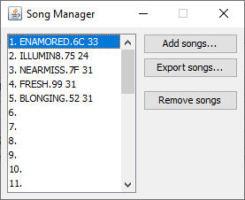
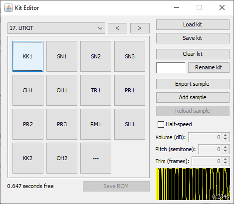

  </head>
**Intense Tech with Defense Mech – ¡Personaliza el LSDj desde cero con el LSDPatch!**
-Publicado February 21, 2021 por [DEFENSE MECHANISM](https://defensemech.com). *Traducción por [Pixel 
Guy](https://apixelguy.com)*

¡Hola y bienvenidos a otra edición de Intense tech! En esta ocasión daremos un vistazo a las últimas 
actualizaciones del LSDPatch, ¡la herramienta que te deja personalizar el LSDj al máximo! ¡Vamos a 
ello!

Primeros pasos con el LSDPatch
------------------------------

Primero lo primero, el LSDPatch requiere Java versión 8.0 o superior. Instalarlo debería ser lo 
suficientemente sencillo si vas a [esta página](https://java.com/es/download) y sigues las 
instrucciones para tu sistema operativo. 

Lo siguiente que te gustaría hacer es descargar la versión más reciente de [la página de descarga 
del LSDPatch](https://github.com/jkotlinski/lsdpatch/releases) (la 1.10.4 al momento de escribir 
este artículo).

Al clicar el botón  «Browse» que está al lado de «Select LSDj ROM file -->» se te permitirá elegir 
el ROM de LSDj que quieras personalizar; además, si hay un archivo de guardado con el mismo nombre, 
se cargará también. Si no hay archivo .sav, puedes hacer clic en el segundo botón «Browse» para 
elegir el archivo de guardado que sea de tu elección. ¡Ahora estamos listos para comenzar a 
modificar las cosas!

Actualizando la ROM del LSDj
-------------------

El botón en la parte inferior izquierda marcado como «Upgrade ROM» nos ofrece una manera fácil de 
actualizar a la versión más reciente del LSDj.

Tienes la opción de elegir entre la versión estable más reciente (la 8.5.1 hasta este momento), la 
última versión liberada (la 9.1.8 justo ahora) o la versión más nueva para Arduinoboy (8.4.1). 
Utilizar este método para actualizar tu ROM mantiene todas las personalizaciones existentes 
intactas, ¡por lo que no hay necesidad de volver a parchar tus kits, paletas de color o fuentes una 
por una! En caso de que así lo desees, puedes elegir la visibilidad de la bitácora de cambios  o la 
información de la licencia.

Organizando las canciones
--------------

Aunque antes era necesario utilizar una aplicación llamada LSDManager para organizar tus canciones, 
esta función ya ha sido añadida al LSDPatch, por lo que —en teoría— esta es la única aplicación que 
necesitarías para manejar cualquier ROM o archivo .sav del LS

Puedes importar archivos .lsdsng (LSDj Song) y puedes exportar archivos .lsdprj (LSDj Project). El 
formato .lsdprj incluye todos los datos de la canción, así como los datos de los kits del ROM de 
LSDj que fueron utilizados en la misma. Esto nos ofrece una manera muy conveniente de compartir 
canciones sin la necesidad de añadir los kits por separado. Vale la pena el mencionar que no importa 
qué ROM sea cargado en el programa, este reemplazará los kits por los de cualquier archivo .lsdprj 
que decidas cargar, ¡así que asegúrate de no sobrescribir el ROM que estés trabajando si quieres 
mantener los kits existentes intactos! Si quieres exportar múltiples canciones, haz clic en la 
primera canción que desees exportar y, mientras mantienes presionado el botón Shift, selecciona 
también la última canción; después haz clic en «Export songs». Elige o crea una nueva carpeta y 
selecciónala para guardar los archivos .lsdprj en la ubicación que seleccionaste.

Personalizando los kits de *samples*
-----------------------

Hablando de los kits, ¡revisemos el nuevo editor de los mismos!

La primera cosa que podrás notar es la disposición de quince *pads* al estilo de una MPC. Hacer clic 
en cada uno de ellos reproducirá el *sample* asociado al mismo. De igual manera, estos están 
programados al teclado de la siguiente manera:
<pre class="listing backtick" style="margin: auto; width: 100px;">
<code>1 2 3 4
Q W E R
A S D F
Z X C</code>
</pre>
Presionar dichas teclas reproducirá la respectiva muestra. 

Hacer clic derecho sobre un *pad* abrirá un menú con las opciones «Drop Sample» (Eliminar sample), 
«Rename Sample» (Renombrar sample) y «Replace Sample» (Reemplazar sample). En los botones de la 
derecha puedes cargar/guardar kits, borrar el kit existente, renombrar y exportar kits, añadir 
samples o cargar de nuevo el *sample* previamente existente. También puedes cargar muestras 
arrastrándolas desde el explorador de archivos y soltándolas en la ventana del editor.

Al agregar nuevos samples se aplica un remuestreo de alta calidad, así
como *dithering* para mantener la mayor cantidad de rango dinámico que
sea posible al convertirse en audio de 4 bits; asimismo se aplica una
nueva técnica para resolver «el problema de la memoria RAM del canal
Wave»[^waveram]. Cada muestra es normalizada al volumen máximo automáticamente.
Una vez que el *sample* es añadido puedes ajustar el volumen, la
afinación o la duración del mismo. ¡Ahora es más fácil que nunca cargar
*samples* en nuestros kits sin necesidad de hacer más preparaciones de
antemano!

[^waveram]Como se puede leer en el tercer apartado de [este
artículo](https://gbdev.gg8.se/wiki/articles/Gameboy_sound_hardware#Obscure_Behavior),
el Gameboy reproduce la primera muestra en un cuadro de onda utilizando
el último sample completo del cuadro de onda anterior. La reproducción
de muestras de sonido requiere recargar la memoria RAM del canal Wave en
cada cuadro, por lo que estos nunca hacen bucle. Para reducir la
cantidad de ruido generada, cada primer cuadro de forma de onda de un
sample esta mezclado eco el último cuadro al momento de hacer el
parche.\
Nota: Este código causa ruido en emuladores que no se ve reflejado en el
error de la memoria RAM del Gameboy.

En la parte superior puedes elegir un kit de un menú desplegable o
utilizar las teclas «\<» y «\>» para desplazarte entre kits.

También debes de haber notado la opción «Half speed». Activar esta
función permite el importar y escuchar muestras a la mitad de su
velocidad normal; lo que también permite *samples* de 4.4 segundos de
duración (con una reducción a la mitad de la calidad del muestreo). Al
hacer esto, la muestra puede volver a ser reproducida a velocidad normal
utilizando la función «Speed 0.5x» en las configuraciones del kit de
instrumentos en el LSDj.

Divirtiéndonos con las fuentes
--------------

¡Ahora demos un vistazo al editor de fuentes!

El editor de fuentes nos ayudará a crear fuentes personalizadas para el
LSDj. Hacer clic en «Show graphics characters» nos dará acceso a editar
los caracteres especiales que se muestran en el editor de formas de onda
del canal Wave, así como en la parte superior de las pantallas Song,
Chain, Phrase, Groove y Table.

Hacer clic derecho o izquierdo en los colores negro, gris y blanco hará
que cada botón utilice el color en el que se hizo clic. Utilizar las
flechas de dirección del teclado hará que los pixeles se muevan una
celda e la dirección de la fecha presionada. También se pueden copiar
líneas enteras y pegarlas en una nueva. Hacer clic en el nombre de la
fuente te permitirá renombrarla. Los fans de los programas de edición de
gráficos pueden guardar las fuentes como archivos .png, editarlos en un
programa externo como Photoshop o Paint y volver a cargar los archivos
.png personalizados en el LSDPatch.

Te podría interesar el visitar el [depósito de fuentes en
Github](https://github.com/psgcabal/lsdfonts) que contiene
una variedad de fuetes enviadas por los usuarios. Si has creado alguna y
te gustaría compartirla, ¡siéntete libre de enviarla!

Pintando las paletas
----------------

Por último, hacer clic en «Palettes» abrirá el editor de paletas de
color.

Esta ventana nos muestra capturas de pantalla de las pantallas Song e
Instrument del LSDj junto con un selector de color y varios espacios
para los mismos. Para seleccionar un color primero hay que hacer clic en
un espacio para color, después hay que clicar e el área dela pantalla
que contenga el color que quieras cambiar y utilizar el selector de
color para elegir el que sea de tu agrado. Puedes pulsar los botones
«Clone color» (Clonar color) o «Swap color» (Intercambiar color), el
cual te permitirá seleccionar un segundo espacio de color para copiar o
intercambiar el color del espacio seleccionado. ¡También puedes utilizar
la función «Randomize all» (Combinaciones aleatorias) y ver qué sucede!

Clicar en «Raw» cambiará el estilo de color actual que está pensado para
ser un buen color de base para diferentes modelos de hardware de Gameboy
Color por uno más saturado que es más común en emuladores de Gameboy.
Hacer clic en «Desaturate» puede ser útil para determinar el contraste
entre colores y proveer un parámetro que sirva para diferentes
percepciones de color. Las paletas de color pueden ser abiertas y
guardadas en archivos .lsdpal.

Siéntete libre de visitar el [depósito de archivos LSDPal en
Github](https://github.com/psgcabal/lsdpals) para ver una
selección de paletas de color enviadas por usuarios, ¡tus aportes
también son bienvenidos!

